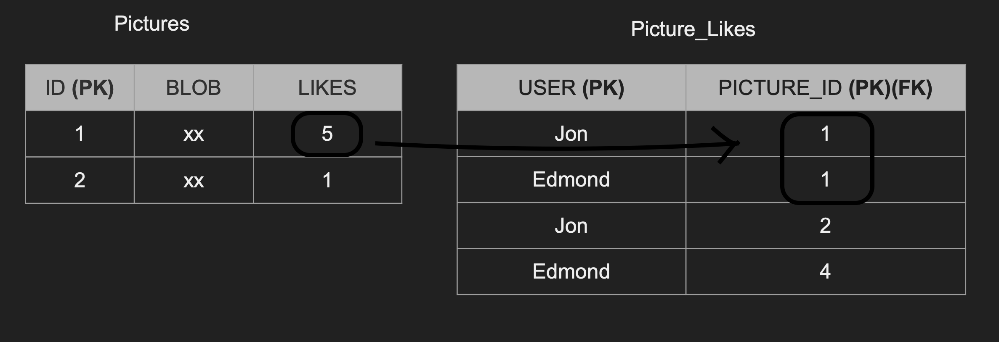

# Consistency

- Ensures that a transaction can only bring a database from one valid, legal state to another
- It guarantees that any data written to the database is valid and strictly adheres to all defined rules, integrity constraints, and relationships

 

## Why Consistency is Vital

While Atomicity ensures that operations are all-or-nothing, Consistency guarantees that what you commit is structurally correct and logical. Together, these rules ensure that your data is never left in a broken or unpredictable state.

 

## Consistency Types

We are looking 2 types of consistency related things

- Data Consistency
- Read Consistency

### Data Consistency

● Defined by the user
● Referential integrity (foreign keys)
● Atomicity
● Isolation

### Read Consistency

● If a transaction committed a change will a new transaction
immediately see the change?
● Affects the system as a whole
● Relational and NoSQL databases suffer from this
● Eventual consistency

 

## Eventual Consistency

[READ MORE](./eventual_consistency.md)
