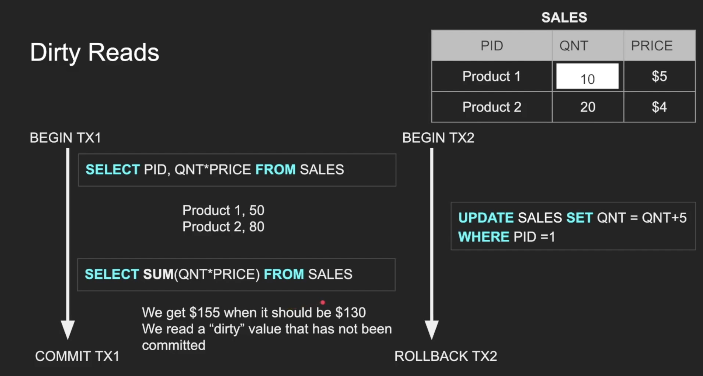
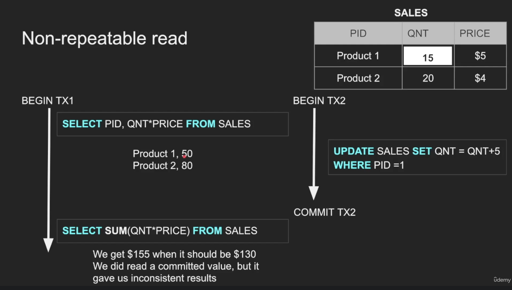
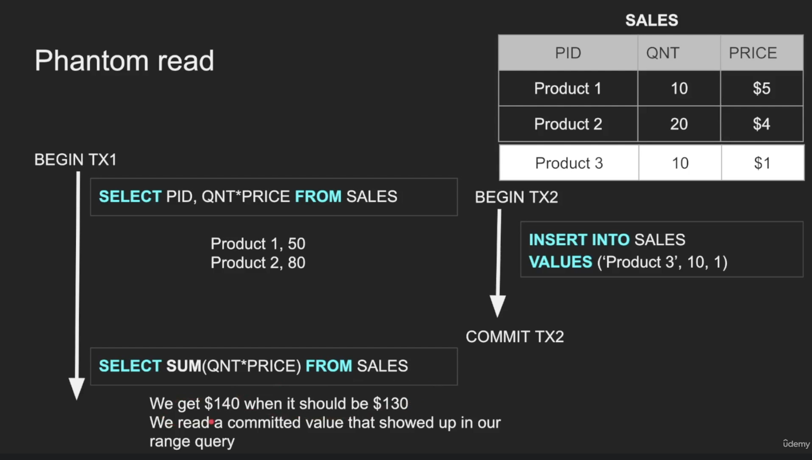
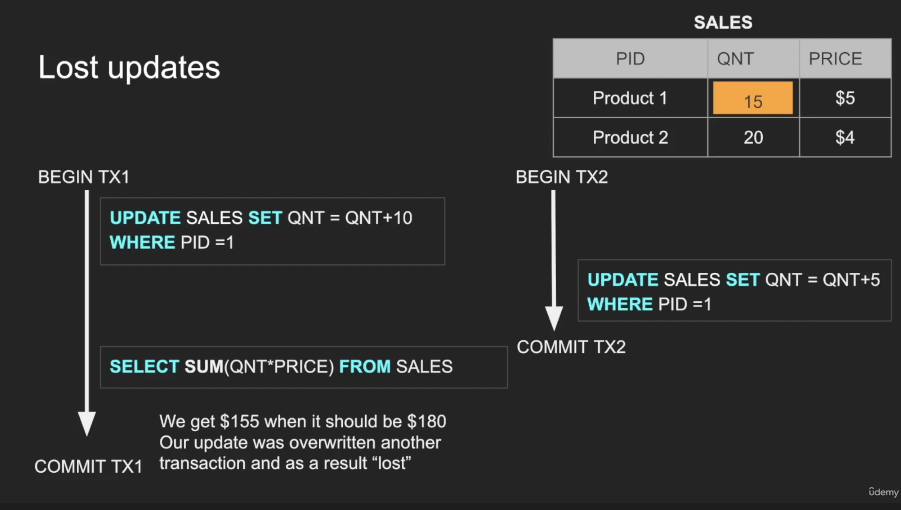
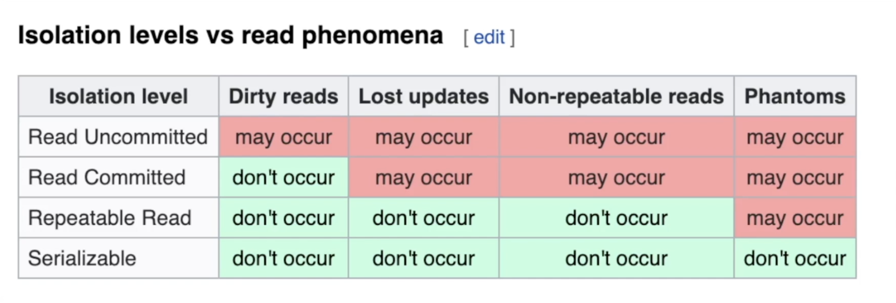

# Isolation

- `Isolation` guarantees that concurrent transactions operate independently without affecting each other.
- Intermediate changes made by one transaction remain invisible to others until the transaction is officially committed, ensuring data integrity.

 

Isolation prevents the following common issues:

**Dirty Reads**: A transaction reads uncommitted changes from another transaction, which might later be rolled back or aborted.

**Non-Repeatable Reads**: A transaction reads the same row twice, but gets different data because another transaction modified the row in the meantime.

**Phantom Reads**: A transaction runs a query twice, and new rows appear because another transaction inserted data while the first transaction was running.

**Lost Updates**: two transactions read the exact same data simultaneously, modify it, and then write it back to the database.

 

## Transaction Isolation Levels

Databases manage isolation through specific levels that trade off between strict data accuracy and system performance.

Ranging from least to most strict, these include:

**Read Uncommitted**: The lowest level. No isolation. Any change from the outside is visible to that transaction, commited or not. Transactions can read uncommitted data from other transactions. It offers maximum performance but is prone to all concurrency issues.

**Read Committed**: Each query in a transaction only sees committed changes by
other transactions. It prevents dirty reads but allows non-repeatable and phantom reads.

**Repeatable Read**: The transaction will make sure that when a query reads a row,
that row will remain unchanged while its running. Prevents both dirty and non-repeatable reads by keeping data locked or using snapshots, though phantom reads can still occur.

**Snapshot**: Each query in a transaction only sees changes that have been
committed up to the start of the transaction. It's like a snapshot version of the
database at that moment

**Serializable**: The strictest level. Transactions are executed completely sequentially. It prevents all concurrency anomalies but can significantly slow down performance due to high lock contention.

---

 

## How to implement Isolation

Each DBMS implements Isolation level differently

- Pessimistic - Row level locks, table locks, page locks to avoid lost updates

- Optimistic - No locks, just track if things changed and fail the transaction if so

- Repeatable read “locks” the rows it reads but it could be expensive if you
read a lot of rows, postgres implements RR as snapshot. That is why you
don’t get phantom reads with postgres in repeatable read

- Serializable are usually implemented with optimistic concurrency control, you
can implement it pessimistically with SELECT FOR UPDATE