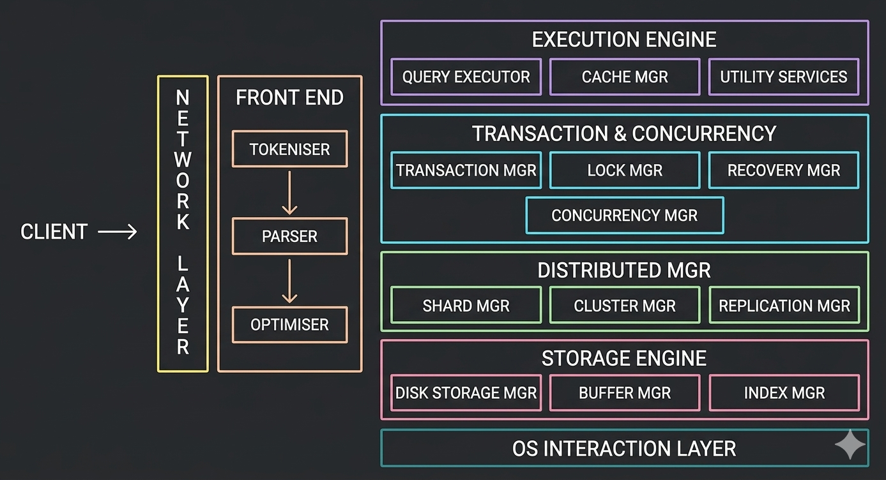

# RDBMS Engine Architecture

**1. The Entrypoint**

`Client`:
The user or application initiating an SQL query request.

`Network Layer`:
Handles connection pooling, protocol parsing, and secure data transmission.

 

**2. FrontEnd (Query Compilation)**

`Tokenizer`:
Breaks raw SQL text strings down into individual syntactic tokens.

`Parser`:
Validates SQL syntax against grammar rules to create a parse tree.

`Optimiser`:
Evaluates multiple execution strategies to find the lowest-cost data retrieval path.

 

**3. Execution Engine**

`Query Executor`:
Runs the step-by-step instructions generated by the optimizer.

`Cache Mgr`:
Stores pre-computed query plans and results to bypass repetitive processing.

`Utility Services`:
Coordinates routine tasks like statistics collection and user authorization checks.

 

**4. Transaction & Concurrency Control**

`Transaction Mgr`:
Guarantees ACID compliance by overseeing transaction starts, commits, and rollbacks.

`Log Mgr`:
Manage Logs

`Recovery Mgr`:
Writes write-ahead logs (WAL) to restore system state after unexpected crashes.

`Concurrency Mgr`:
Coordinates the scheduling of simultaneous operations to ensure strict transaction isolation.

 

**5. Distributed Architecture Layer**

`Shard Mgr`:
Determines which physical shard holds specific partitions of split horizontal data.

`Cluster Mgr`:
Monitors node heartbeats and manages cluster configuration state.

`Replication Mgr`:
Syncs data writes across primary and replica database instances.

 

**6. Storage Engine & OS Interaction**

`Buffer Mgr`:
Allocates cache pages in RAM to reduce slow physical disk reads.

`Index Mgr`:
Speeds up record lookup operations using structured trees or hashes.

`Disk Storage Mgr`:
Defines the exact physical layout of tablespaces on non-volatile hardware.

`OS Interaction Layer`:
Converts high-level storage commands into low-level operating system system calls.
