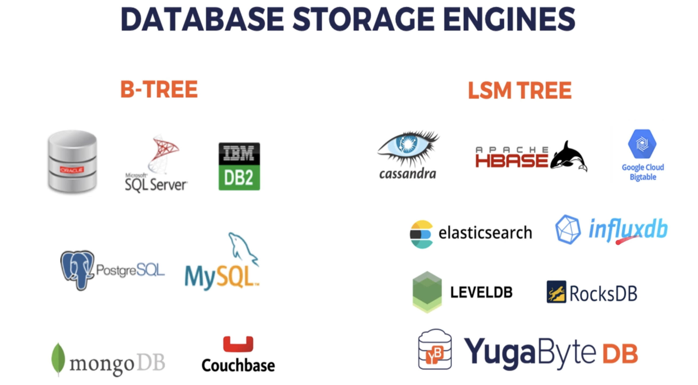

# Database Engines

- A `database engine` (also known as a `storage engine` or `embedded database`) the core underlying software component that a Database Management System (DBMS) uses to query operations

 

- Database system that handles:
    - Disk storage
    - Data retrieval (queries)
    - CRUD operations (Create, Read, Update, Delete)

 

- The reason why we’ve the database engine is because now you don’t have to build your own database from scratch

 

- So DBMSs are created by adding features on top of database engines

 

- We can reuse robust engines and build custom database systems around them. Some DBMSs, like MySQL and MariaDB, let you choose or switch engines.

 

- Some DBMS can change the db engine (`mysql`, `mariadb`) some can't (`psotgres`)

---

## Some DB Engines

- MyISAM
- InnoDB
- XtraDB
- SQLite
- Aria
- BarkeyleyDB
- LevelDB
- RocksDB

