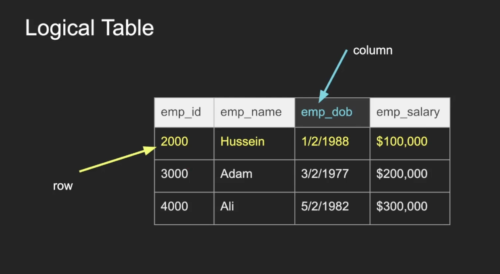
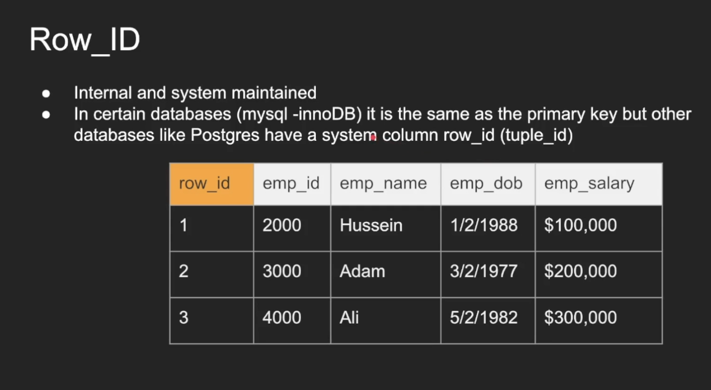
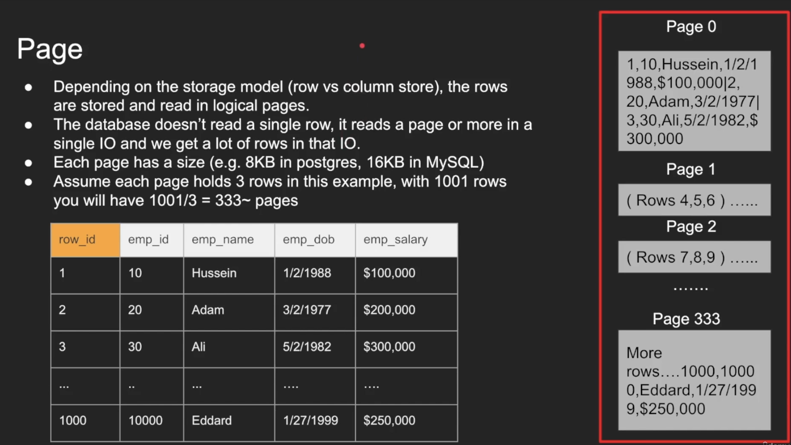
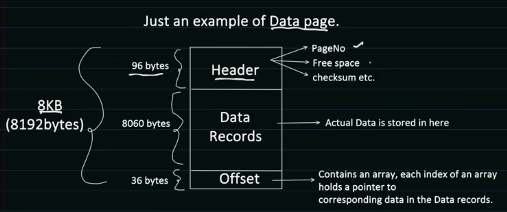
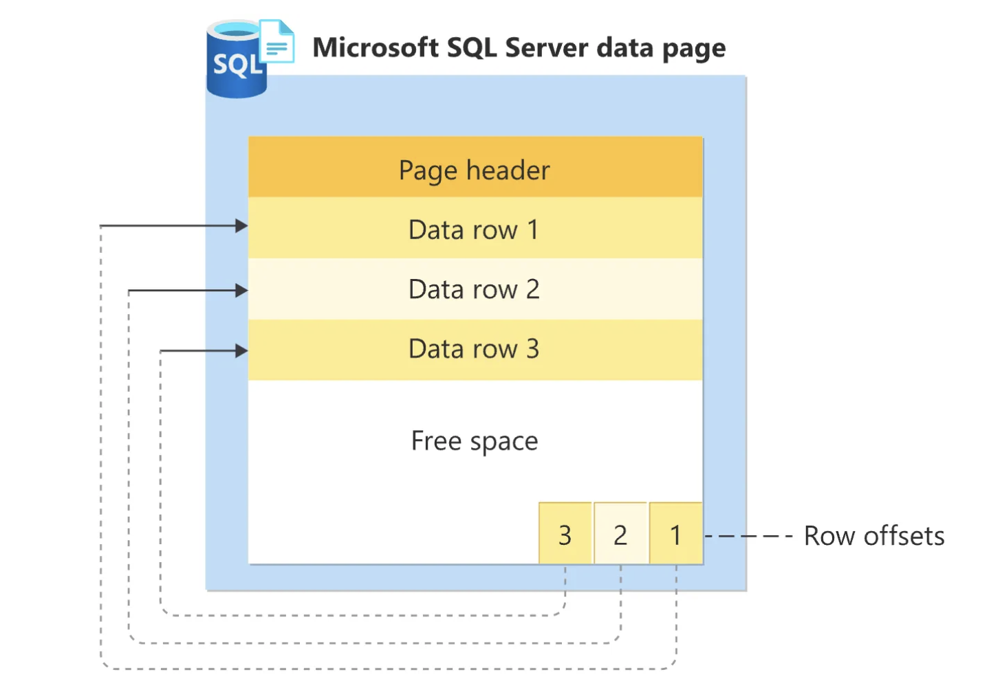
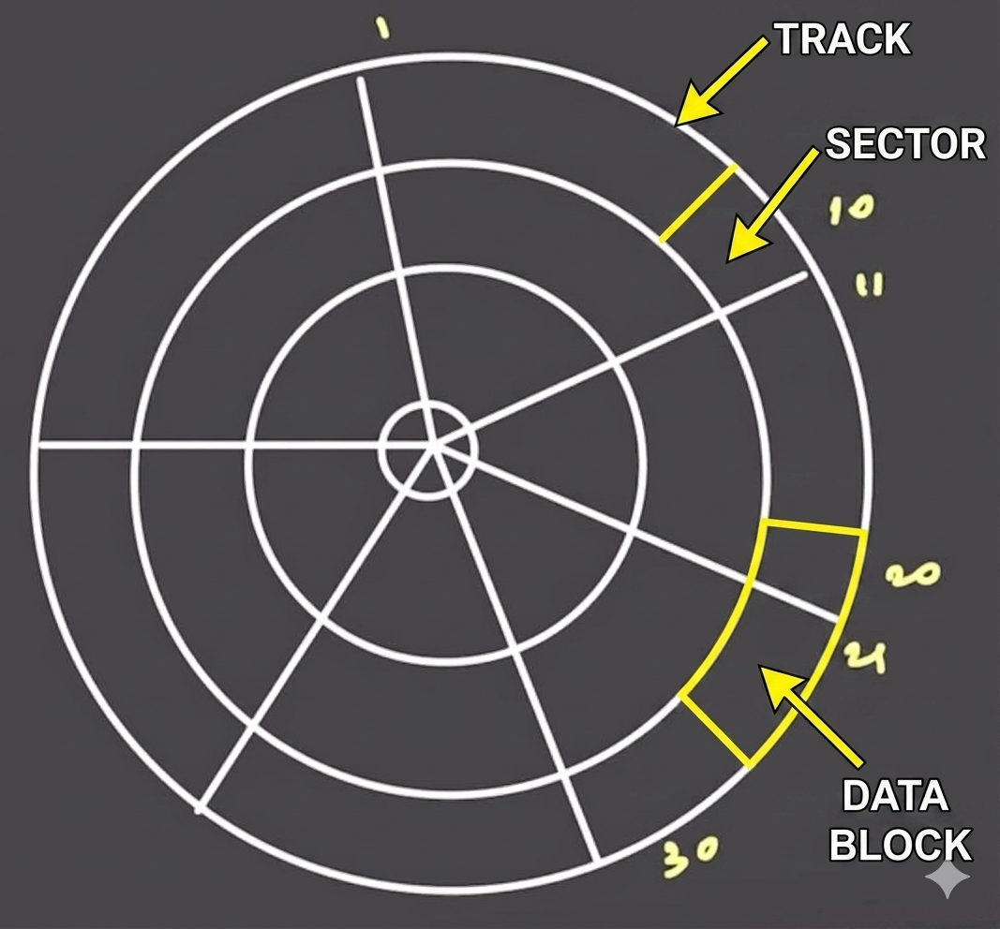
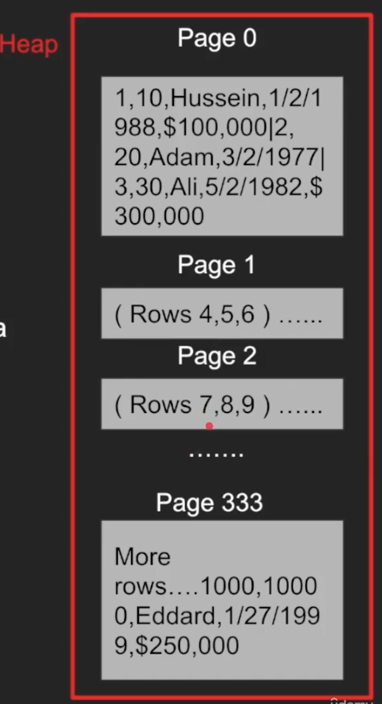
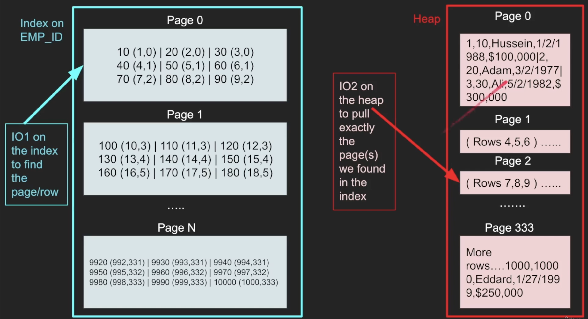

# Storage Concepts

## Table



- Data stored as not tables. This is just a logical data representation
- End of the day rows and columns those are acts as bits/byts

---

## Row Id



- This id maintaining by database
- Some databases it can be `primary key` (considered as row_id), others can be have a `seperate column` for row_id

---

## Page



- In a database, a page is the `fundamental, fixed-size unit of data storage and Input/Output (I/O)`

- Pages are created by Database

- Pages are stored inside of `Data Blocks` and those are stored inside of Heap

- Instead of reading and writing to a disk one byte or one row at a time, the database engine processes data in these specific chunks (usually 4KB to 16KB depending on the system)

- DBMS creates a map between pages and blocks

Database Engine    | Default Page Size | Configurable Range
-------------------|-------------------|------------------------------------------
PostgreSQL         | 8 KB              | Requires re-compilation / re-initialization
MS SQL Server      | 8 KB              | Fixed (Cannot be changed)
MySQL (InnoDB)     | 16 KB             | 4 KB, 8 KB, 32 KB, 64 KB
MongoDB (WiredTiger)| 32 KB             | Dependent on storage engine config
SQLite             | 4 KB              | 512 Bytes to 64 KB




---

## IO

- IO operation (input/output) is a `read request to the disk`
- We try to minimize this as much as possible
- An IO can fetch 1 page or more depending on the disk partitions and other factors
- An IO cannot read a single row, its a page with many rows in them, you get them for free.
- You want to minimize the number of IOs as they are expensive.
- Some IOs in operating systems goes to the operating system cache and not disk

```bash
Reducing I/O (Input/Output) operations is one of the most effective ways to boost query performance
```

---

## Storage Architecture Internals



**How Data Reads and Processes (Using Diagram)**

```
[ Application Query ]
         │
         ▼
 1. CHOOSE TARGET       ───► The database determines the record resides at block [20, 21].
         │
         ▼
 2. SEEK TRACK          ───► The mechanical arm shifts inward/outward onto the target Track ring.
         │
         ▼
 3. READ MULTI-SECTOR   ───► As the platter spins, the magnetic head pulls the Data Block 
         │                   (sectors 20 and 21 together) off the disk surface.
         ▼
 4. LOAD TO RAM         ───► The raw block bytes copy into the database Buffer Pool inside RAM.
         │
         ▼
 5. CPU PROCESS         ───► The Database Engine reads the exact row variables from RAM 
         │                   into CPU Registers to execute your code modifications.
         ▼
 6. STORE / FLUSH       ───► After updating memory, a background thread flushes the modified 
                             data block back down to overwrite sectors 20 and 21 on the disk.
```

<br/>

---

## Heap Data Structure



- The Heap is `data structure where the table is stored with all its pages one after another`
- This is where the actual data is stored including everything
- Traversing the heap is expensive as we need to read so may data to find what we want
- That is why we need indexes that help tell us exactly what part of the heap we need to read. What page(s) of the heap we need to pull

---

## Index Data Structure / B-Tree

- An index is another data structure separate from the heap that has “pointers” to the heap
- It has part of the data and used to quickly search for something
- You can index on one column or more. 
- Once you find a value of the index, you go to the heap to fetch more information where everything is there
- Index tells you EXACTLY which page to fetch in the heap instead of taking the hit to scan every page in the heap
- The index is also stored as pages and cost IO to pull the entries of the index. 
- The smaller the index, the more it can fit in memory the faster the search
- Popular data structure for index is b-trees, learn more on that in the b-tree section

---

## Query example


