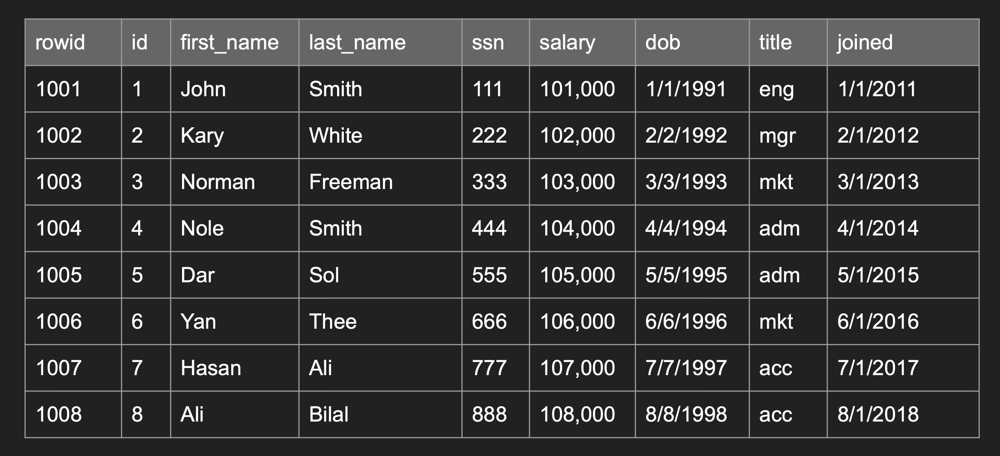
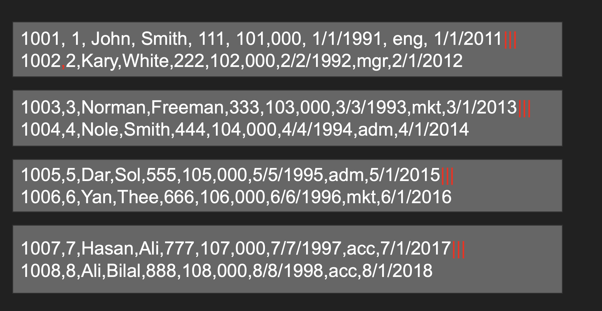
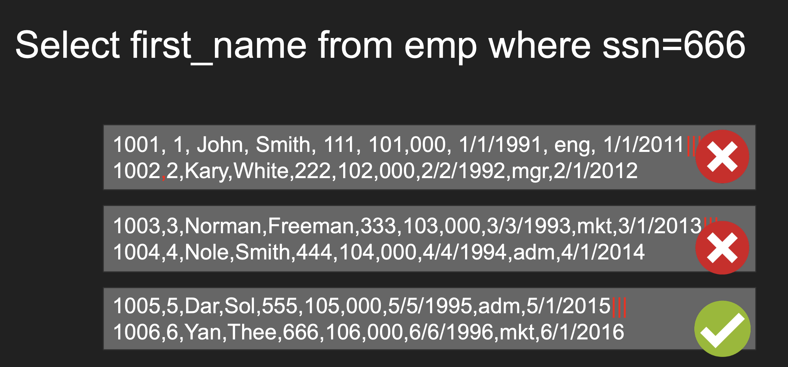
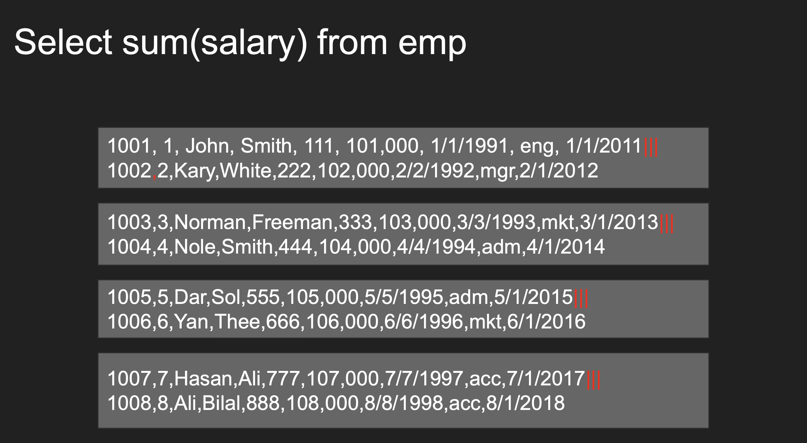
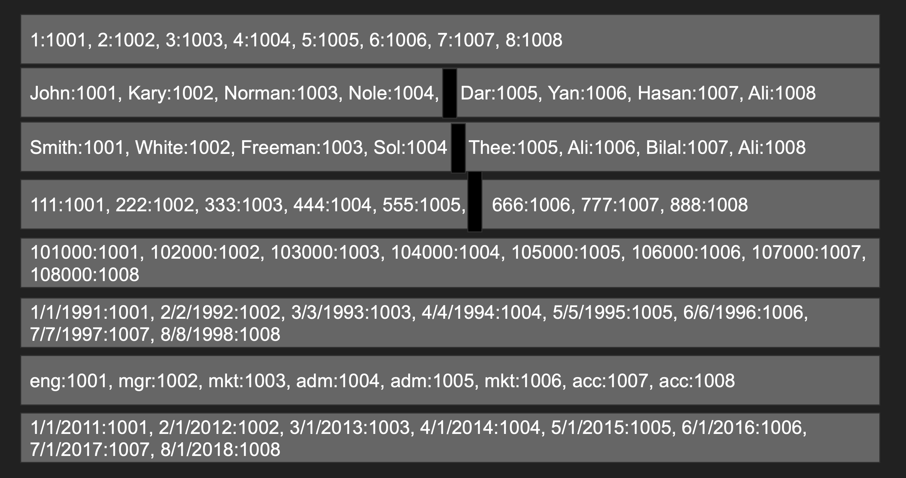
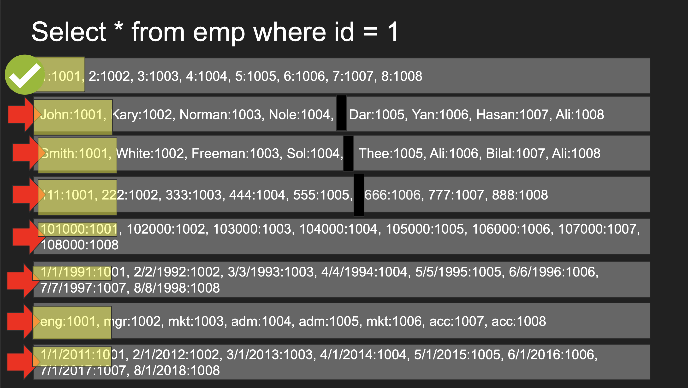
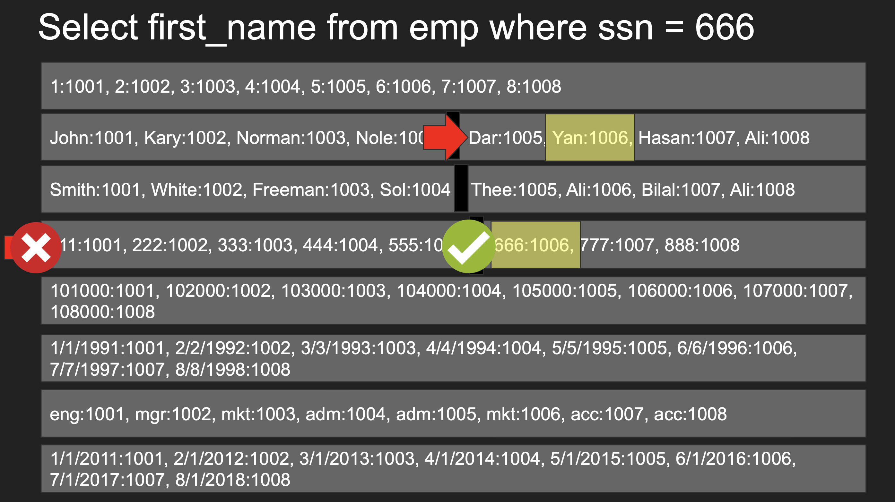
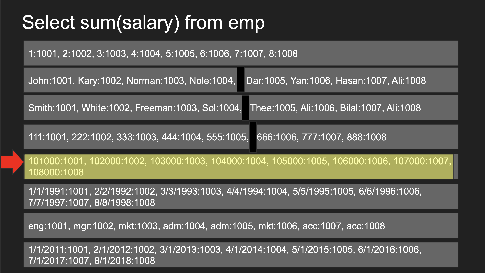

# Row and Column Oriented Databases

Databases read data by blocks not read every bits/bytes.
Depending on how data stores inside of a storage, databases can have 2 types:

- Row Oriented Databases / Store
- Column Oriented Databases / Store

after that,

- Document Oriented Databases / Store

 

## Row Oriented Databases / Store

- Data are stored as rows in disk
- A single block io read to the table fetches multiple rows
with all their columns
- More IOs are required to find a particular row in a table
scan but once you find the row you get all columns for that
row

Example:

This is the table that we are creating by ourselves

Row Oriented DB stores these as below. Stores like rows inside of each blocks / pages

Let's see how it performs when some queries meet

1. When search with db id is extremely fast and know what is the page we are looking for. After that we have all the fields that it has they are stored as rows

2. When search with a field name should go thorugh every pages to find but once we find we have all the data for that

3. When we use aggregations also we have to go though all the pages one by one to find all the data. Extremely cost

---

## Column Oriented Databases / Store

- Tables are stored as columns first in disk
- A single block io read to the table fetches multiple
columns with all matching rows
- Less IOs are required to get more values of a given
column. But working with multiple columns require more
IOs.
- OLAP

Example:

This is the table that we are creating by ourselves

Row Oriented DB stores these as below. Stores like row columns inside of each pages / blocks

Let's see how it performs when some queries meet

1. When search with db id is not fast like row databases because once it found it it needs to find other columns in other blocks

2. When search with a field name should go thorugh every blocks to find

3. When we use aggregations extremely fast because all the data relted to salary column are stored as a single one. Extremely fast

 

## Pros and Cons

| Row-Based | Column-Based |
| :--- | :--- |
| Optimal for read/writes | Writes are slower |
| OLTP (Online Transactional Processing) | OLAP (Online Analytical Processing) |
| Compression isn't efficient | Compress greatly |
| Aggregation isn't efficient | Amazing for aggregation |
| Efficient queries w/multi-columns | Inefficient queries w/multi-columns |

 

## Usage

- Use for `Transactional` / `Day to Day Databases`
- Use for `Analytical Databases`
