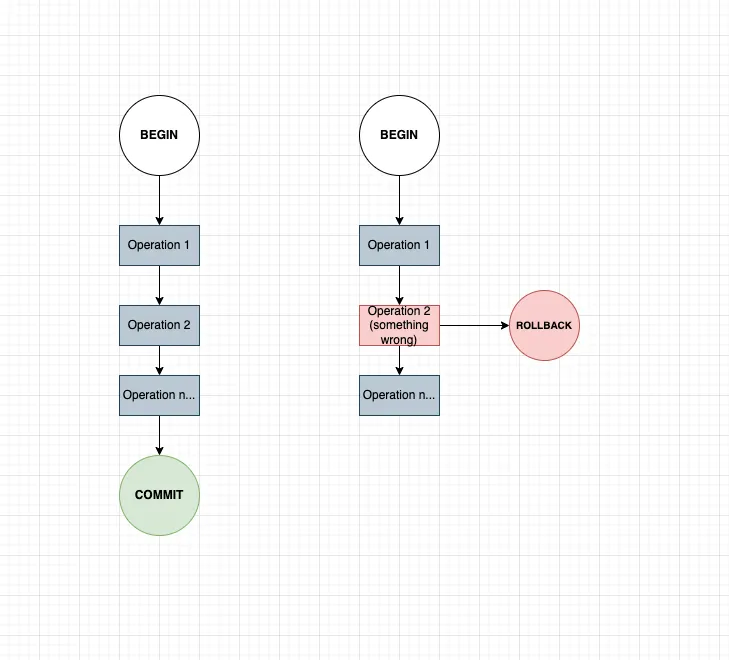

# Transaction

- **Database transaction** is a `set of queries` treated as `one unit of work`.

<br/>

## Transaction Lifespan



**BEGIN** - About to start a new transaction with multiple queries

**COMMIT** - Queries executes successfully. Persist these things in the disk. This can be READS and WRITES/UPDATE/DELETE

**ROLLBACK** - Queries are not executed properly or if we are not satisfied, then we should forget about all the changes we have done before this query during the transaction lifetime. UNDO or ROLLBACK all changes

<br/>

## Transaction Types

**Explicit Transaction**

You should define the transaction boundary explicitly (we manually define start and end) with BEGIN keyword, and COMMIT after execution. ROLLBACK for unsatisfied cases.

We control exactly when the transaction starts and ends

```sql
BEGIN TRANSACTION;

UPDATE Accounts
SET Balance = Balance - 100
WHERE AccountID = 1;

UPDATE Accounts
SET Balance = Balance + 100
WHERE AccountID = 2;

COMMIT;
```

**Implicit Transaction**

The implicit transaction is when the database automatically starts a transaction for us..

```sql
UPDATE Accounts
SET Balance = Balance - 100
WHERE AccountID = 1;
```

<br/>

If we run queries without explicitly transaction boundary every time an implicit transaction wraps around every individual statement to save the changes to DB.

Ex: Alice wants to send $100 to Bob, and your first query deducted $100 from Alice’s account successfully, but something went wrong when you tried to credit/update it in Bob’s account. In this scenario, $100 is lost in space (maybe it can handle it in a tricky way), and you should again undo all queries that executed successfully. But with an explicit transaction, until your queries execute successfully and the execution of COMMIT, it won’t save in DB. If get something wrong in the query execution, ROLLBACK will undo everything by itself. There is no need to consider which one has changed or not.

<br/>

| Explicit Transaction                  | Implicit Transaction        |
| ------------------------------------- | --------------------------- |
| Started manually                      | Started automatically       |
| Controlled by programmer/user         | Controlled by database      |
| Uses `BEGIN TRANSACTION` and `COMMIT` | No need to explicitly start |
| Good for multiple related operations  | Good for simple operations  |
